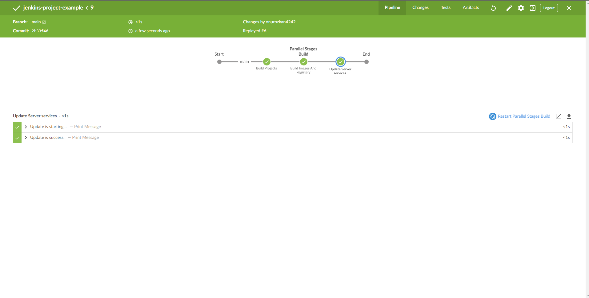
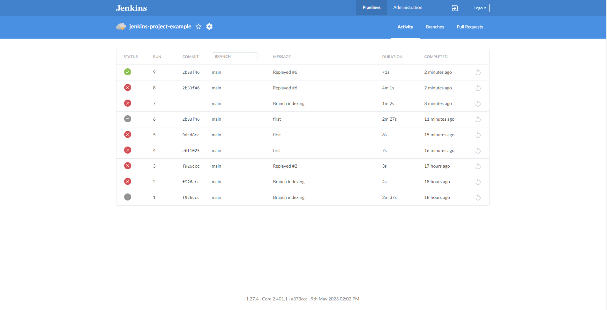
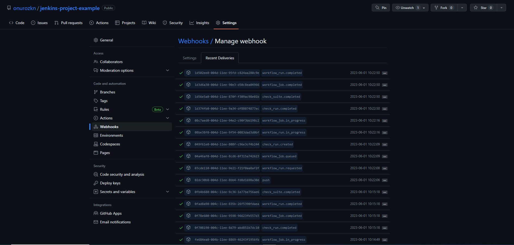

# jenkins-project--example

## Jenkins Stages

This project is built and deployed using Jenkins pipelines. The Jenkins pipeline includes the following stages:

- Build frontend and backend images
- Push images to Docker Hub
- Build app image
- Push app image to Docker Hub
- Deploy app container

You can see the Jenkins steps and webhooks configured in the respective Jenkinsfiles for each stage. These files define the specific actions and configurations needed to perform each step of the pipeline. By organizing the pipeline into separate Jenkinsfiles, you can run individual stages independently or combine them into a larger pipeline as per your requirements. Additionally, you can leverage webhooks to trigger the Jenkins pipeline automatically upon specific events, such as code commits or pull requests, ensuring continuous integration and deployment.

-----

-----

